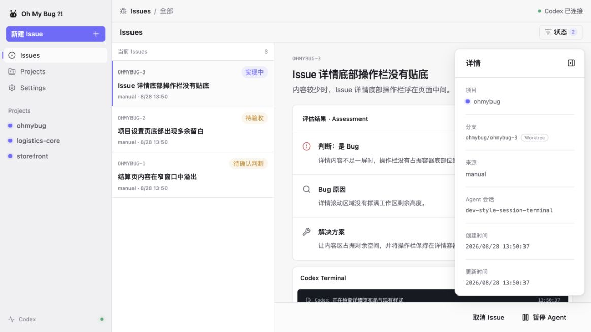
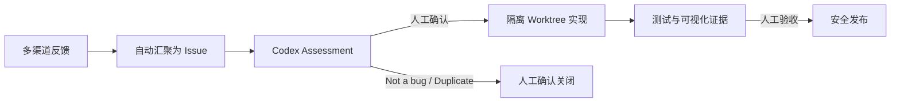

<div align="center">
  

# Oh My Bug

### 让多渠道反馈，自动进入 AI 判断与交付流程

来自不同渠道的用户反馈会被自动汇聚并交给 AI，完成问题判断、原因分析与解决方案建议。
经你确认后，Codex 继续实现与验证；每一份交付都以真实截图或录屏为证据。

[](#快速开始)
[](https://www.electronjs.org/)
[](https://www.typescriptlang.org/)
[](https://nodejs.org/)
[](#本地优先与安全边界)

[快速开始](#快速开始) · [工作方式](#一条-issue-如何完成) · [架构](#架构) · [项目文档](#项目文档)

</div>



<p align="center"><sub>一个界面看清 Issue 状态、AI 判断、执行过程、验收证据与交付结果。</sub></p>

## 从问题到可验收改动

Oh My Bug 不是另一个聊天窗口。它把零散的软件改动请求组织成一条可追踪、可暂停、可审核的交付流程。

| 收集 | 判断 | 实现 | 验收 |
| --- | --- | --- | --- |
| 多渠道反馈自动汇聚为统一 Issue | AI 给出 Bug / Feature 判断、原因与方案 | Codex 在隔离 Worktree 中修改、测试并处理冲突 | 用截图或录屏证明结果，由人决定是否交付 |

### 你始终掌握最后决定

- **Assessment 门禁**：AI 完成判断后等待人工确认，不会自行关闭 Issue。
- **Delivery 门禁**：实现完成后先提交可视化证据，再等待人工验收。
- **安全发布**：验收通过的提交以受保护的 fast-forward 方式进入基线；基线变化时重新验证。
- **随时接管**：在 macOS Terminal 中继续同一个 Codex 会话，不丢失上下文，也不绕过门禁。

## 一条 Issue 如何完成



实现过程中，Runtime 持续记录 Issue 状态、Agent 会话与事件。文本冲突和可并存的业务改动由 Codex 处理；只有当基线行为与 Issue 要求真正互斥时，系统才会请求人工选择。

## 快速开始

### 环境要求

- macOS
- Node.js 22+
- pnpm
- Git
- 已登录的 Codex CLI

```bash
git clone git@github.com:preflower/ohmybug.git
cd ohmybug
pnpm install
pnpm exec playwright install chromium
pnpm doctor
pnpm dev
```

`pnpm dev` 启动 Electron 桌面应用，并连接真实的本机 Runtime 与数据目录。

只想快速浏览界面时，可以启动只读 Web 预览。空数据目录会自动显示演示数据：

```bash
pnpm dev:web
```

## 核心能力

- **多渠道反馈接入**：将不同来源的反馈自动汇聚为统一 Issue，并交给 AI 分类与分析。
- **完整 Issue 状态机**：Assessment、执行、Repair、Evidence、Delivery 全程可追踪。
- **隔离式 Git 执行**：每个 Issue 在独立 Worktree 中工作，不覆盖主工作区里的个人改动。
- **证据驱动交付**：只有截图或录屏可以进入 Delivery 验收。
- **共享 Agent 会话**：桌面端与 Terminal 连接同一 Codex thread，可继续、暂停和接管。
- **本机持久化**：SQLite、Keychain 与证据文件全部保留在本地。

## 架构

```text
apps/
  desktop/                 Electron 生命周期、IPC 和产品界面
  runtime/                 编排、Worker、Integration 生命周期

packages/
  core/                    Issue、状态机、端口与通用契约
  agent-codex/             Codex Agent Adapter 与 App Server
  integration-manual/      Manual Adapter
  integration-sentry/      Sentry Adapter
  integration-dingtalk/    DingTalk Adapter
  storage/                 SQLite、Keychain 与验收证据
  workspace-git/           Git Worktree 与安全发布
  workspace-local/         本地工作区支持
```

更完整的数据流、边界与流程图见 [架构文档](docs/architecture.md)。

## 本地优先与安全边界

- 数据默认保存在 `~/.oh-my-bug`，也可以通过 `OH_MY_BUG_HOME` 指定其他目录。
- Integration 密钥只进入系统 Keychain，DTO 与事件只暴露“是否已配置”。
- Renderer 不具备 Node、Electron、文件系统、Git 或任意 IPC 权限，只能访问冻结的 Runtime protocol API。
- Runtime 运行在 Electron Utility Process；关闭窗口只隐藏 UI，从菜单栏退出才会完整停止服务。
- Web 预览只读取启动时快照，不会把浏览器操作写回 Runtime。

## 开发与验证

```bash
pnpm typecheck
pnpm lint
pnpm test
pnpm build:desktop
pnpm test:e2e
```

生成并验证 macOS 应用：

```bash
pnpm package
pnpm doctor:package -- "--app=out/Oh My Bug-darwin-arm64/Oh My Bug.app"
pnpm test:e2e:electron
```

## 项目文档

| 文档 | 内容 |
| --- | --- |
| [架构](docs/architecture.md) | 系统边界、数据流与模块职责 |
| [配置](docs/configuration.md) | 项目、Integration 与本地运行配置 |
| [Agent 边界](docs/agent-core.md) | Codex 会话、门禁与执行约束 |
| [故障排查](docs/troubleshooting.md) | 开发、运行与打包常见问题 |
