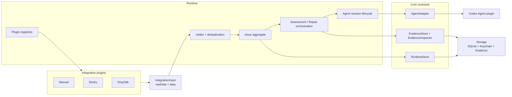

# 系统架构

当前设计由 Runtime 统一编排业务流程。Desktop Renderer 只是展示容器和人工触发点，因此不属于核心业务架构；它只通过 `@oh-my-bug/runtime/protocol` 与独立 Runtime 进程通信。

`@oh-my-bug/core` 只定义纯状态转换和跨包端口。具体 Agent、Integration 与 Storage 实现互不依赖，只有 `apps/runtime/src/composition.ts` 可以导入并组装它们。Integration 插件是内置包，但通过同一清单、校验和生命周期合同可插拔；Desktop 不包含任何渠道字段分支。

Runtime Worker 使用单进程有界调度器，同时推进最多 3 个不同 Issue。新进入队列的 Issue 会在存在空闲槽位时立即启动；同一 Issue 的 Workspace、Assessment、Repair、Evidence 与 Finalize 操作始终串行。每个 Issue 的独立 worktree 继续作为文件系统隔离边界，SQLite compare-and-swap 更新继续作为持久状态保护。

## Issue 主流程

```mermaid
stateDiagram-v2
  [*] --> RECEIVED: IntegrationInput accepted
  RECEIVED --> ASSESSING
  ASSESSING --> REVIEW_REQUIRED: Assessment ready
  ASSESSING --> ASSESSMENT_FAILED: Agent failure
  ASSESSMENT_FAILED --> ASSESSING: retry or confirmed session rebuild

  REVIEW_REQUIRED --> CLOSED: confirm NOT_A_BUG or DUPLICATE
  REVIEW_REQUIRED --> ASSESSING: request reassessment
  REVIEW_REQUIRED --> REPAIRING: approve implementation, request changes, or choose business intent
  REVIEW_REQUIRED --> FINALIZING: accept Delivery

  REPAIRING --> REVIEW_REQUIRED: mutually exclusive business behavior
  REPAIRING --> EVIDENCE_CHECK: integrated Delivery ready
  EVIDENCE_CHECK --> REPAIRING: invalid visual evidence
  EVIDENCE_CHECK --> REVIEW_REQUIRED: evidence accepted
  REPAIRING --> REPAIR_FAILED: Agent failure
  REPAIR_FAILED --> REPAIRING: retry or confirmed session rebuild

  FINALIZING --> REPAIRING: base advanced or publication requires revalidation
  FINALIZING --> COMPLETED: guarded fast-forward publication
```

所有人工暂停统一表示为 `REVIEW_REQUIRED + ReviewRequest`；Core 只校验有限选项、revision、request identity 和后续状态，不理解 Assessment、Delivery 或业务冲突的具体原因。Runtime 根据 `review.kind` 生成界面语义并提交一个 `submitReview` 命令。

Assessment 与全部 Repair iteration 使用同一个 provider-native 会话。对于配置为合并到基线的 Git Workspace，每次 Repair 都重新观察最新基线 commit，并要求 Agent 在 Issue worktree 内完成实现、基线集成、冲突处理、提交和验证。文本冲突及可兼容的业务改动由 Agent 处理；只有双方业务行为互斥时才生成 `business-merge-conflict` 审核。通过证据验收后，Git Provider 仅以受保护的 fast-forward 发布已验证 commit；基线再次前进则回到新一轮 Repair。会话缺失时 Runtime 以 `AGENT_SESSION_UNAVAILABLE` 明确失败，只有用户点击重建后才退休旧记录、创建新会话并恢复原阶段。Runtime 只接受截图或录屏证据；批准 Delivery 后 Issue 以 `COMPLETED / FIXED` 或 `COMPLETED / IMPLEMENTED` 结束。`CLOSED` 保留给 `NOT_A_BUG` 和 `DUPLICATE`。
