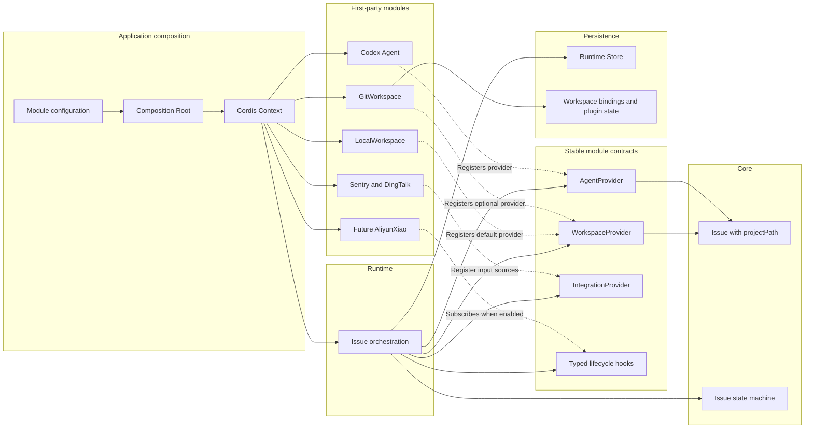

# Internal Plugin and Workspace Design

## Goal

Add a small internal plugin mechanism based on Cordis and use Workspace providers as its first complete capability. The existing Issue flow must continue without Git; enabling Git gives each Issue an isolated worktree and creates a commit only after user approval.

This mechanism exists to keep first-party project modules loosely coupled. It is not a third-party plugin platform.

## Confirmed constraints

- All modules are developed by this project and compiled into the application.
- Modules may be enabled, disabled, or selected through project configuration.
- Core does not know about Cordis, Workspace, Git, Worktree, or AliyunXiao.
- Core stores only the concrete project directory assigned to an Issue as `Issue.projectPath`.
- Assessment, Repair, and Evidence use `Issue.projectPath`; they do not derive a path from `RuntimeProject.path`.
- Git creates no diff report, test run, or checkpoint commit automatically.
- Git commits only after the user approves the delivery.
- Git delivery returns explicit `BranchInfo`, not a generic delivery artifact.
- A future AliyunXiao module is optional and must not block the normal Issue flow.
- Dynamic package installation, a plugin marketplace, hot reload, and third-party permission isolation are out of scope.

## Architecture



Only the Composition Root imports concrete modules. Runtime depends on stable contracts. Modules do not import other concrete modules or Runtime internals.

## Cordis responsibilities

Cordis provides module mounting, dependency readiness, lifecycle ownership, and cleanup. A disabled module is not mounted or its Fiber is disposed. Runtime business logic contains no checks such as `if (gitEnabled)` or `if (aliyunEnabled)`.

Cordis is not exposed to Core. No additional public `OhMyBugPluginAPI`, dynamic loader, or global arbitrary-string event bus is introduced in the first phase.

Activation has two explicit levels:

- Application composition decides which compiled modules are available and mounted. LocalWorkspace is always mounted; GitWorkspace and other optional modules may be omitted.
- Runtime project configuration selects which available Workspace provider new Issues use. Selecting an unavailable provider is a configuration error and never silently falls back to LocalWorkspace.

Workspace selection and module configuration live in the Runtime project model, not the Core Issue domain model.

## Core model

Core adds one neutral field:

```ts
interface Issue {
  projectPath?: string;
}
```

`projectPath` means the directory in which this Issue is assessed and repaired. Core does not know how the directory was created.

- Local mode: `Issue.projectPath = RuntimeProject.path`.
- Git mode: `Issue.projectPath = worktree path`.

`projectPath` is optional while the directory is being prepared. Assessment cannot be queued until it is assigned.

Core also separates user approval from final completion:

```text
ACCEPTANCE_REVIEW -> APPROVED -> COMPLETED
```

`APPROVED` records the durable user decision. Runtime finalization may then publish the selected Workspace. Local finalization completes immediately; Git finalization commits and optionally pushes first. A publish failure leaves the Issue approved and retryable without rerunning Repair.

## Runtime Workspace state

Runtime persists the binding between an Issue and the selected provider outside Core:

```ts
interface WorkspaceBinding {
  issueId: string;
  providerId: string;
  resourceId: string;
  status: "PREPARING" | "READY" | "FAILED" | "RELEASED";
  lastError?: string;
  createdAt: string;
  updatedAt: string;
}
```

Provider-specific data remains owned by the provider. For Git this includes worktree path, branch name, base branch, and base revision. It is not added to the Core Issue schema.

## Workspace provider contract

```ts
interface WorkspaceProvider {
  id: string;

  acquire(input: {
    issue: Issue;
    project: RuntimeProject;
  }): Promise<{
    projectPath: string;
    resourceId: string;
  }>;

  publish(input: {
    issue: Issue;
    resourceId: string;
  }): Promise<BranchInfo | undefined>;

  release(input: {
    issue: Issue;
    resourceId: string;
  }): Promise<void>;
}

interface BranchInfo {
  name: string;
  commit: string;
  remote?: string;
}
```

Workspace provider registration is lifecycle-owned by its Cordis module. Runtime selects a provider from project configuration. Existing Issues retain their persisted provider binding even if the project default later changes.

## LocalWorkspace behavior

LocalWorkspace is the default provider and preserves the current no-Git flow.

- `acquire()` returns `RuntimeProject.path` as `projectPath`.
- `publish()` returns `undefined`.
- `release()` performs no filesystem cleanup.
- User approval transitions the Issue through `APPROVED` to `COMPLETED` without a commit.

## GitWorkspace behavior

GitWorkspace is optional.

### Acquire

1. Resolve the configured baseline branch and revision.
2. Create an Issue-specific branch and worktree.
3. Persist provider state using an idempotent Issue-derived resource identity.
4. Return the worktree directory as `projectPath`.
5. Runtime persists the Workspace binding and assigns `Issue.projectPath` before queuing Assessment.

Assessment, every Repair iteration, and Evidence processing read the same persisted `Issue.projectPath`.

### Publish

1. Run only after the Issue reaches `APPROVED`.
2. Create the Git commit.
3. Push only when the project delivery mode is remote.
4. Persist and return `BranchInfo`.
5. Runtime transitions the Issue to `COMPLETED` after publish succeeds.

No commit is created before approval. No automatic diff collection, test execution, or checkpoint commit is added.

`BranchInfo` is stored in Git plugin state keyed by Issue and exposed through the Runtime product API. It is not added to the Core Issue schema. Delivery approval returns the completed Issue plus optional branch information:

```ts
interface ApprovalResult {
  issue: Issue;
  branch?: BranchInfo;
}
```

### Release

After a successful publish, release removes the worktree but retains the delivered local or remote branch. A failed publish keeps the worktree for retry. Cancellation does not automatically delete a worktree with uncommitted changes; explicit cleanup is required to avoid losing work.

## Lifecycle hooks

The first phase exposes a small typed lifecycle surface:

```text
issue.beforeCreate
issue.created
assessment.before
assessment.after
repair.before
repair.after
issue.userApproved
issue.completed
```

These hooks are for observation and optional follow-up behavior. Required return values use capability contracts such as `WorkspaceProvider`; Workspace acquisition does not rely on a listener mutating an Issue path implicitly.

Hook failures are recorded against the owning module and do not roll back an already completed Core transition. Work that needs durable retry uses Runtime operations rather than an in-memory hook alone.

## Optional future modules

AliyunXiao is not required for the first implementation. A future enabled instance consumes persisted `BranchInfo`, starts the configured pipeline for that branch, and automates configured review nodes. When disabled, absent, or failed, it does not prevent the Issue from completing. Its pipeline execution has its own durable operation and retry status.

AliyunXiao depends on the stable branch information contract, not the GitWorkspace implementation.

## Intake isolation fix

Integration input idempotency is project-scoped. Storage lookup and uniqueness change from:

```text
(integration, input_key)
```

to:

```text
(project_id, integration, input_key)
```

This prevents an input in one project from being treated as a duplicate of an Issue in another project.

## Recovery and consistency

- Workspace acquisition is idempotent for an Issue. Restart reconciliation resumes Issues without `projectPath` from their persisted Workspace binding.
- `READY` and assignment of `Issue.projectPath` are persisted atomically before Assessment is queued.
- An existing Issue always resolves its provider through `WorkspaceBinding`, never through the project's current default.
- User approval is persisted before publish starts.
- Publish retry does not rerun Assessment or Repair.
- Git publish success persists `BranchInfo` before the Issue becomes completed.
- Runtime never silently falls back from an existing Git binding to LocalWorkspace.

## Implementation scope

The first implementation includes:

- Cordis-backed first-party module composition and lifecycle cleanup.
- Stable provider and typed hook contracts.
- LocalWorkspace and GitWorkspace providers.
- `Issue.projectPath` and persisted Workspace bindings.
- Assessment, Repair, and Evidence migration from `RuntimeProject.path` to `Issue.projectPath`.
- User approval separated from final completion.
- Git commit on approval, optional push, and `BranchInfo` persistence.
- Workspace acquire and publish retry behavior.
- Project-scoped integration input idempotency.

AliyunXiao implementation, dynamic third-party plugins, automatic tests, diff reports, checkpoint commits, plugin marketplace features, and broad Runtime concurrency redesign are out of scope.

## Verification

- Core tests cover assignment and immutability of `Issue.projectPath`, the `APPROVED` state, and final completion.
- Runtime tests prove Assessment cannot start before `projectPath` is ready.
- LocalWorkspace acceptance tests preserve the current no-Git workflow.
- Git tests use temporary repositories to verify worktree isolation, stable paths across iterations, no pre-approval commit, local delivery, remote delivery, retry after publish failure, and restart recovery.
- Integration tests prove identical input keys in different projects create or update only their own Issues.
- Module lifecycle tests prove enabling registers behavior and Fiber disposal removes it without affecting the baseline flow.
- AliyunXiao is represented only by a contract-level test double proving optional BranchInfo consumers can be absent without blocking completion.
